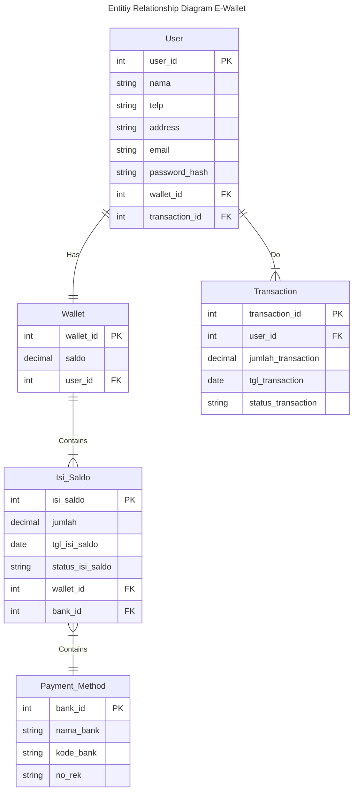

```mermaid
---
title: Entitiy Relationship Diagram E-Wallet
---
erDiagram

User ||--|| Wallet: Has
User ||--|{ Transaction: Do
Wallet ||--|{ Isi_Saldo: Contains
Isi_Saldo }|--|| Payment_Method: Contains

User {
	int user_id PK
	string nama
	string telp
	string address
	string email
	string password_hash
	int wallet_id FK
	int transaction_id FK
}

Wallet {
	int wallet_id PK
	decimal saldo
	int user_id FK
}

Payment_Method {
	int bank_id PK
	string nama_bank
	string kode_bank
	string no_rek
}

Isi_Saldo {
	int isi_saldo PK
	decimal jumlah
	date tgl_isi_saldo
	string status_isi_saldo
	int wallet_id FK
	int bank_id FK
}

Transaction {
	int transaction_id PK
	int user_id FK
	decimal jumlah_transaction
	date tgl_transaction
	string status_transaction
}

```