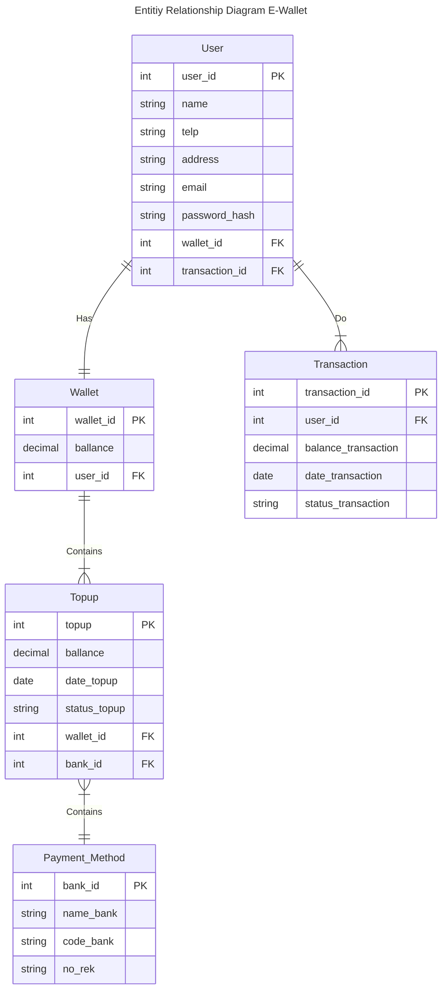

```mermaid
---
title: Entitiy Relationship Diagram E-Wallet
---
erDiagram

User ||--|| Wallet: Has
User ||--|{ Transaction: Do
Wallet ||--|{ Topup: Contains
Topup }|--|| Payment_Method: Contains

User {
	int user_id PK
	string name
	string telp
	string address
	string email
	string password_hash
	int wallet_id FK
	int transaction_id FK
}

Wallet {
	int wallet_id PK
	decimal ballance
	int user_id FK
}

Payment_Method {
	int bank_id PK
	string name_bank
	string code_bank
	string no_rek
}

Topup {
	int topup PK
	decimal ballance
	date date_topup
	string status_topup
	int wallet_id FK
	int bank_id FK
}

Transaction {
	int transaction_id PK
	int user_id FK
	decimal balance_transaction
	date date_transaction
	string status_transaction
}

```